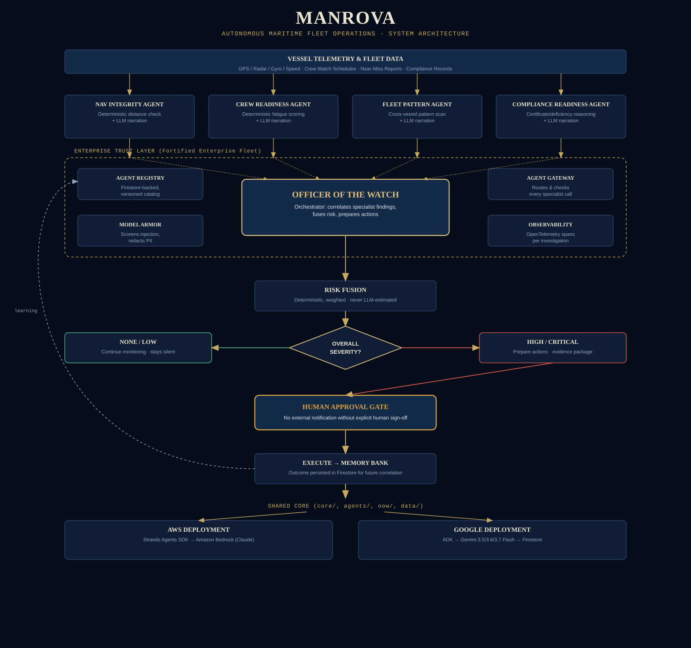

# Manrova

**An agentic maritime operations system.** Manrova watches, investigates, and coordinates on behalf of a fleet operator, so that a human only steps in when a decision genuinely requires one.



## The problem

A vessel produces a constant stream of operational signals: navigation data, crew conditions, near-miss reports, compliance records. None of this is missing information. The problem is that no one has time to correlate four different systems, for every vessel, every day, before a pattern becomes an incident report instead of a warning.

## What Manrova does

Manrova is built around four specialist agents and a central orchestrator, the **Officer of the Watch (OOW)**.

- **Navigation Integrity Agent**: monitors GPS, radar-derived position, gyro heading, and speed for disagreement beyond a safe threshold.
- **Crew Readiness Agent**: assesses fatigue and readiness risk from watch-schedule data.
- **Fleet Pattern Agent**: scans near-miss and incident data across the fleet for recurring patterns a single vessel's history wouldn't reveal.
- **Compliance Readiness Agent**: reasons about certificate and deficiency exposure relative to a vessel's actual schedule, not just raw expiry dates.

Their findings flow into the Officer of the Watch, which decides what additional context is needed, correlates the evidence, and passes it through deterministic risk logic to establish overall severity. For lower-risk situations, Manrova continues monitoring, silently. For higher-risk situations, it prepares a response and brings a human into the loop, every time, before anything external is sent.

**The system assists the watch. It does not replace the watch.**

## Design principle: deterministic tools, agentic reasoning

Safety-critical math (position deviation, risk scoring, incident state transitions) is deterministic Python, never left to a language model to estimate. The LLM layer sits on top of that structured output to interpret evidence, coordinate specialist findings, and narrate the result in plain language. See `docs/architecture-overview.md` for the full diagram.

## Real vessel data, not only mock data

Manrova's live site supports two paths: a fixed demo scenario for a one-click walkthrough, and a real registration flow where any fleet operator can register, add a vessel (a real name or an internal alias, never required to disclose a hull identity), and run an investigation on genuinely entered navigation and crew data. For testing, public AIS-derived position data for a real, currently operating vessel was used as the basis for a realistic scenario, clearly separated from the synthetic demo data used elsewhere.

## Repository layout

```
Manrova/
├── core/                     # domain models, incident state machine, risk fusion (shared)
├── agents/                   # four specialist agents (deterministic tools + LLM reasoning seam)
├── oow/                      # Officer of the Watch: the orchestrating agent
├── data/demo/                # synthetic fleet + incident scenario data
├── apps/cli/                 # runnable command-center demo (provider-agnostic)
├── providers/aws/strands/    # AWS/Strands Agents SDK implementation, on Amazon Bedrock
├── providers/google/adk/     # Google ADK implementation, on Gemini
├── enterprise/                # Agent Registry, Memory Bank, Gateway, Guardrail, Observability
├── manrova_simulator/         # standalone real-time simulation environment (local use)
├── api/                       # serverless endpoints backing the live site
├── public/                    # the live command-center frontend
├── tests/                     # unit tests for state machine, risk fusion, workflow
└── docs/                      # architecture diagrams and setup notes
```

## Quick start

```bash
python3 -m venv .venv
source .venv/bin/activate
pip install -r requirements.txt

# Run the full end-to-end demo scenario
python3 -m apps.cli.demo_runner

# Run tests
pytest tests/ -q
```

### AWS / Strands

```bash
pip install -r providers/aws/strands/requirements-aws.txt
aws configure   # requires AWS credentials with Bedrock model access
python -m providers.aws.strands.agents
```

See `providers/aws/strands/README.md` for details.

### Google / ADK

```bash
pip install -r providers/google/adk/requirements-google.txt
export GOOGLE_API_KEY=<your Gemini API key>
adk run providers/google/adk
```

See `providers/google/adk/README.md` for details.

### Enterprise components (Agent Registry, Memory Bank, Identity, Gateway, Guardrail, Observability)

See `enterprise/SETUP.md` for a full, no-cost setup guide using Firestore's free tier and IAM service accounts.

### Live site

The deployed command center is at [manrova.vercel.app](https://manrova.vercel.app). It supports a one-click demo scenario, and a real multi-tenant flow where any fleet can register, add a vessel, and run an investigation on real submitted data, with results persisted and retrievable across sessions.

### Local simulation environment

`manrova_simulator/` runs a standalone, real-time synthetic maritime environment with a tactical map, live telemetry, and injectable incident scenarios, wired into the real Officer of the Watch pipeline. `manrova_simulator/background_watch.py` demonstrates genuine autonomous background monitoring: it polls continuously and stays silent until the Officer of the Watch actually finds something worth a human's attention. See `manrova_simulator/README.md`.

## What we learned

Building an agentic system turned out to be less about giving a language model more responsibility, and more about giving each agent a clear, narrow responsibility, deciding what information it can trust, and knowing exactly when control has to return to a human. Deterministic logic and agentic reasoning work better together than either one trying to do everything: the deterministic layer provides boundaries, the agents provide interpretation and coordination, and the human provides final authority when the situation actually requires it.

## Status

- [x] Shared core: domain models, incident state machine, risk fusion
- [x] Four specialist agents, deterministic logic with an LLM reasoning seam
- [x] Officer of the Watch orchestration, end to end incident workflow
- [x] AWS/Strands provider, verified against real Bedrock/Claude credentials
- [x] Google/ADK provider, verified against real Gemini credentials, with multi-model fallback
- [x] Live multi-tenant site with real Firestore-backed persistence
- [x] Enterprise components: Agent Registry, Memory Bank, Agent Identity, Agent Gateway, Model Armor guardrail, Observability
- [x] Standalone real-time simulation environment with autonomous background monitoring

## License

MIT, see [LICENSE](LICENSE).

## Note

Demo Vessel data is synthetic and used for illustration. My Fleet accepts real vessel data supplied by the user. Manrova makes no connection to, and no claim of control over, any real vessel's operational systems.
