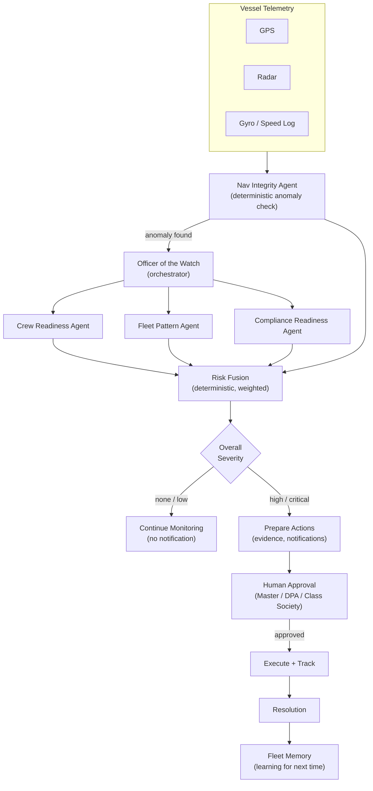
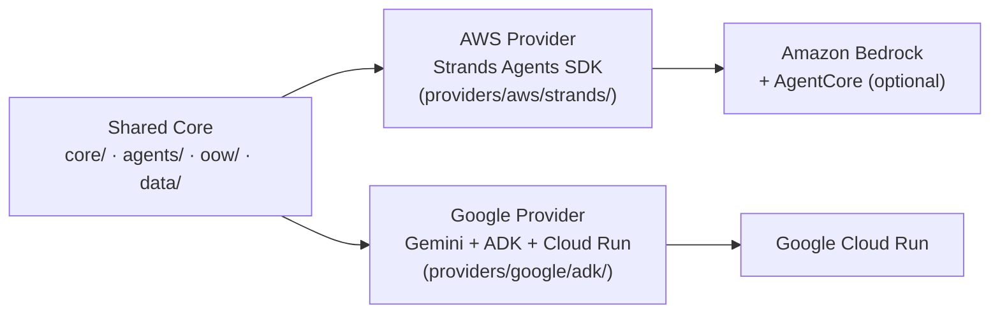

# Manrova Architecture



## Provider layering



`core/`, `agents/`, `oow/` and `data/` are the **shared product core** -
identical business logic for both hackathon submissions. Only
`providers/aws/` and `providers/google/` differ.

## Fallback ASCII version (if Mermaid doesn't render in your viewer)

```
MANROVA
   |
Officer of the Watch (OOW)
   |
   +------------------+------------------+------------------+
   |                  |                  |                  |
Nav Integrity     Crew Readiness     Fleet Pattern      Compliance
   |                  |                  |                  |
   +------------------+------------------+------------------+
                       |
                 Risk Fusion (deterministic)
                       |
          +------------+------------+
          |                         |
     Auto Actions             Human Approval
          |                         |
          +------------+------------+
                       |
                Incident State
                       |
          +------------+------------+
          |                         |
       Memory                Observability
```

## Layering

```
MANROVA CORE  (core/, agents/, oow/, data/)
   |
Provider Interface
   |
   +-----------------------------+-----------------------------+
   |                                                            |
AWS Implementation                                    Google Implementation
   |                                                            |
Strands Agents SDK, AgentCore                         Gemini 3.5+, Google ADK, Google Cloud
```

`core/`, `agents/`, `oow/` and `data/` are the **shared product core** -
identical business logic for both hackathon submissions. Only `providers/aws/`
and `providers/google/` differ.

## Deterministic tools vs. agentic reasoning

Per the build spec, safety-critical math is never delegated to an LLM:

- `agents/nav_integrity/agent.py` - haversine distance, deviation thresholds
- `core/risk/fusion.py` - weighted risk scoring, severity banding
- `core/domain/state_machine.py` - strict incident state transitions

The LLM layer (Strands or Gemini, wired in via `providers/`) sits on top of
these structured outputs to interpret, narrate, and decide next actions - it
never recomputes the numbers itself.

## Where the AWS/Strands and Google/ADK builds plug in

Each specialist agent has a "reasoning seam" comment marking where a real
model call replaces the current deterministic evidence list with an
LLM-refined narrative. The Officer of the Watch's `handle_telemetry` / `approve_and_execute`
flow doesn't change per provider - only how each agent's `.analyze()` /
`.assess()` method is implemented does.

See `providers/aws/strands/README.md` and `providers/google/adk/README.md`
for the provider-specific wiring notes.
